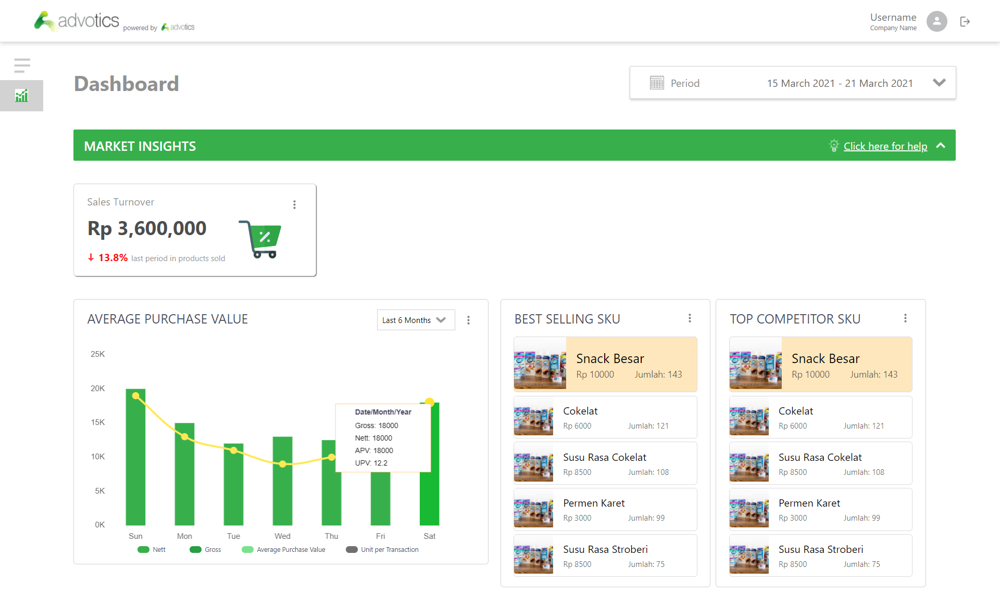

# Advotics Dashboard
> Dashboard user interface page developed using React.js



By : Dionisius Darryl Hermansyah

## General Info
A Dashboard is a user interface that organizes and presents complex data with easy to digest visualization. The requirement of this task is to develop a dashboard page based on a mockup including a filter period feature and all the market insight dashboard visualization. Backend server or database are not required.

## Live Demo
[Here](https://competent-mcnulty-d764fb.netlify.app/)

## Features
* Market insight visualization
* Filter period
* Interactive components

## Tech Stack
* React.js
* Chart.js (Charting tools)
* React-Calendar.js

## How to Run
1. Make sure you have ```npm``` installed in your local computer
2. Clone this repository
3. Navigate into the main folder and run ```npm install``` to get all the dependencies
4. Run ```npm start``` and the app should be opened in your browser

## Notes
This app is developed in 15.60-inch screen 1920x1080 px environment and has not been responsively optimized.

## Available Scripts

In the project directory, you can run:

### `npm start`

Runs the app in the development mode.\
Open [http://localhost:3000](http://localhost:3000) to view it in the browser.

The page will reload if you make edits.\
You will also see any lint errors in the console.

### `npm test`

Launches the test runner in the interactive watch mode.\
See the section about [running tests](https://facebook.github.io/create-react-app/docs/running-tests) for more information.

### `npm run build`

Builds the app for production to the `build` folder.\
It correctly bundles React in production mode and optimizes the build for the best performance.

The build is minified and the filenames include the hashes.\
Your app is ready to be deployed!

See the section about [deployment](https://facebook.github.io/create-react-app/docs/deployment) for more information.

## Thank you
